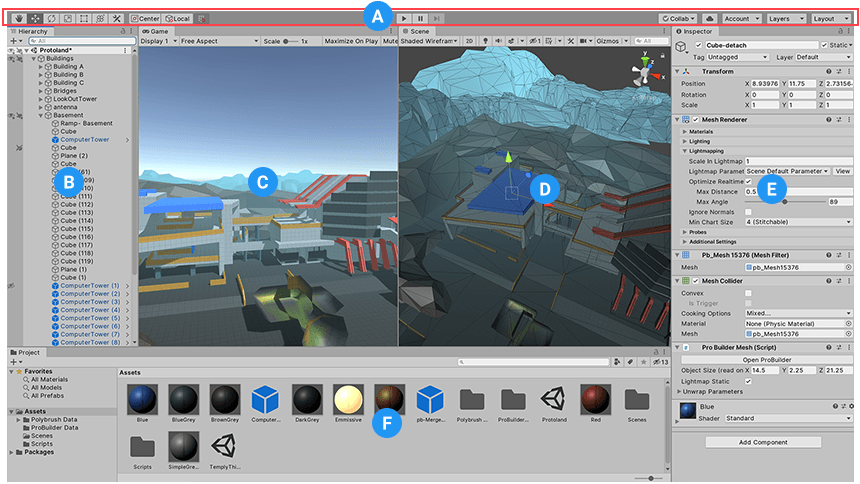
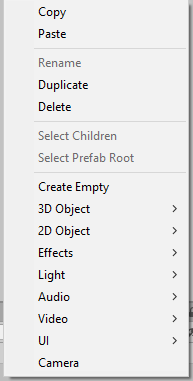
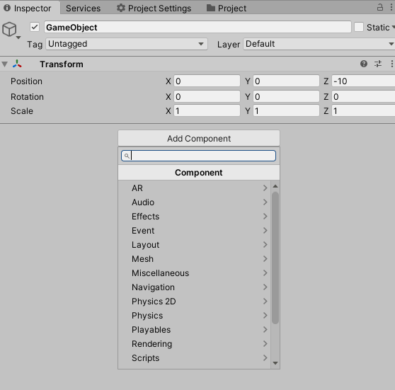
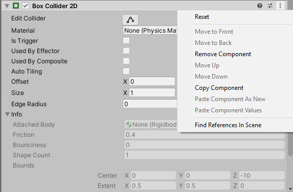
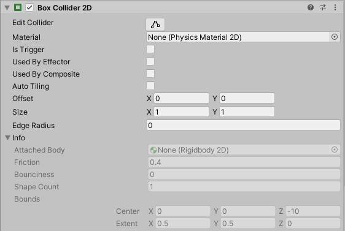

# Game-Dev-TC-modul-1
Modul 1 Komunitas Game Dev TC 2020
## Tujuan
1. Peserta memahami unity
2. Peserta memahami GameObject dan Components
3. Peserta memahami Script Mono Behaviour
4. Peserta memahami Input System
5. Peserta dapat mengubah properti component

## Unity
Unity adalah Game Engine Cross-Platform yang dikembangkan oleh Unity Technologies. Berikut adalah layout editor yang paling umum.

- (A) Toolbar memberikan kontrol ke scene view dan game object. Bagian kiri ada hand tool, move tool, rotate tool, scale tool, rect tool, multi tool. Bagian ditengah ada kontrol play, pause, dan step control. Bagian dikanan ada kontrol untuk unity collab, account, layers dan layout.
- (B) Hierarchy berisi representasi struktur game object di scene. Jadi semua game objek di scene dapat dilihat di hierarchy.
- (C) Game View menunjukkan apa yang dilihat oleh kamera atau yang akan dilihat oleh pemain.
- (D) Scene View adalah cara kita untuk melihat atau mengedit game objek yang ada di scene. Scene View dapat melihat scene dari prespektif 2D atau 3D.
- (E) Inspector View menunjukkan list komponen - komponen beserta propertinya untuk objek yang sedang diselect.
- (F) Project Window menunjukkan file atau asset yang dapat digunakan dalam gamenya.
(https://docs.unity3d.com/Manual/UsingTheEditor.html)
## Game Object dan Component
### Game Object
Game Object adalah representasi objek didalam unity. Game Object dapat merepresentasikan karakter, prop, pohon, dan lain-lain. Game Object berfungsi sebagai container component. Component ini yang mempunyai fungsi atau tujuan masing-masing.
#### Membuat Game Object

Untuk membuat game object, klik kanan di hierarchy, lalu klik Create Empty.
#### Mengganti nama Game Object
Untuk mengganti nama Game Object, dapat klik kanan suatu game object lalu rename. Selain itu dapat menggunakan shortcut F2.
(https://docs.unity3d.com/Manual/class-GameObject.html)
### Transform Component
Setiap Game Object minimal mempunyai satu komponen, yaitu Transform. Transform mengontrol posisi, besar, dan rotasi game objek. Selain itu transform juga memungkinkan konsep parenting.
(https://docs.unity3d.com/Manual/Components.html)
### Other Component
Selain itu Game Object juga dapat mempunyai komponen-komponen lain.
#### Adding Component

Untuk menambahkan komponen lain. Klik game object yang ingin ditambahkan. Lalu klik Add Component dan pilih component yang mau ditambahkan.
#### Removing Component

Untuk menghapus komponen. Klik simbol tiga titik di pojok kanan component. Lalu klik Remove Component.
#### Editing Component

Mengubah properti component dengan merubah isi checkbox, dan text box yang ada di component masing masing.
(https://docs.unity3d.com/Manual/UsingComponents.html)
## Mono Behaviour Script
### Membuat Script
Klik kanan di project view > Create > C# Script
### Anatomy Script
Berikut adalah script default yang akan dibuat oleh unity.
```
using UnityEngine;
using System.Collections;

public class Movement : MonoBehaviour {

    // Use this for initialization
    void Start () {
    
    }
    
    // Update is called once per frame
    void Update () {
    
    }
}
```
Dapat dilihat ada 2 function yang dibuat oleh unity
- ```Start``` dipanggil sekali saat game object pertama masuk di scene
- ```Update``` dipanggil setiap frame
### Menempelkan script ke game object
Ada 2 cara,
1. Drag and drop script dari project view ke object yang diinginkan di hierarchy
2. Select object di hierarchy, klik add component, lalu cari nama script, tekan script tersebut
## Input System
## Mengubah Properti Component