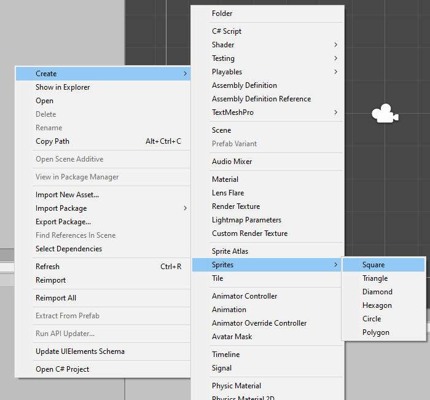
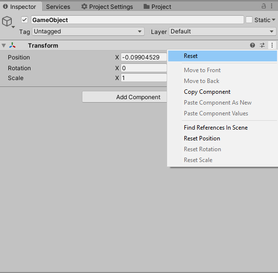
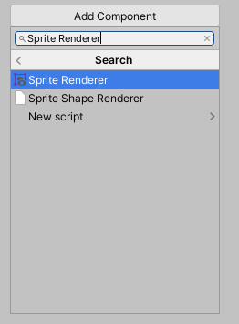
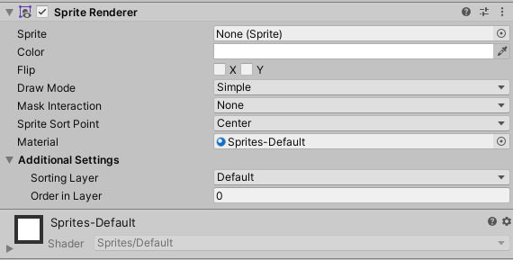
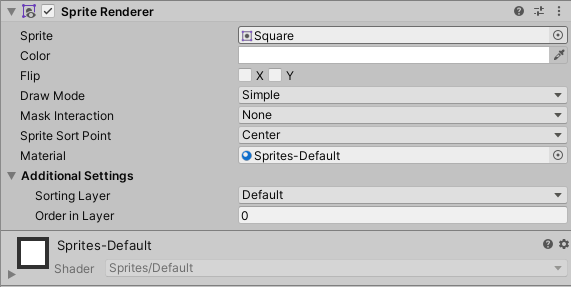
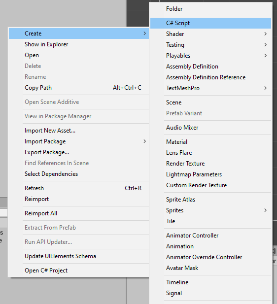
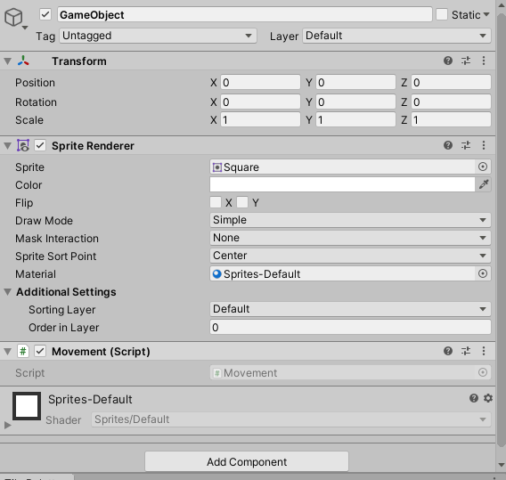
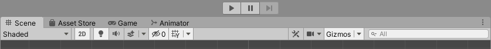
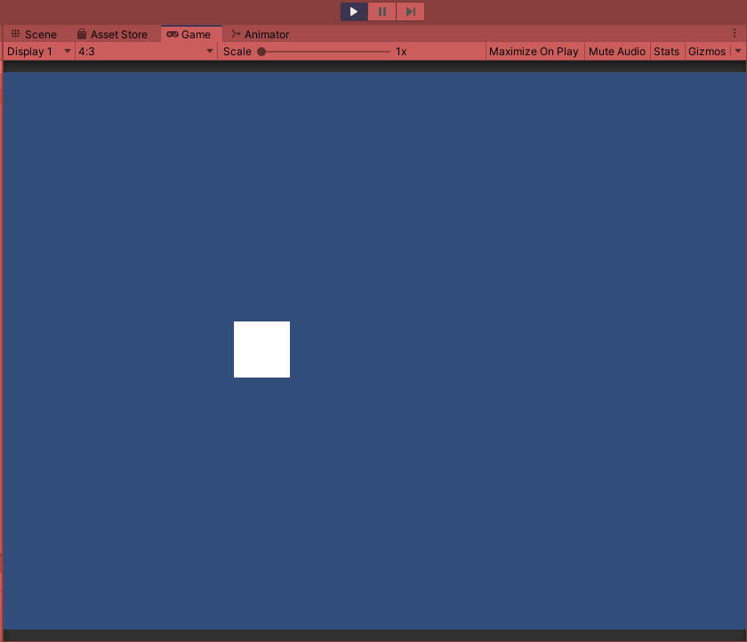
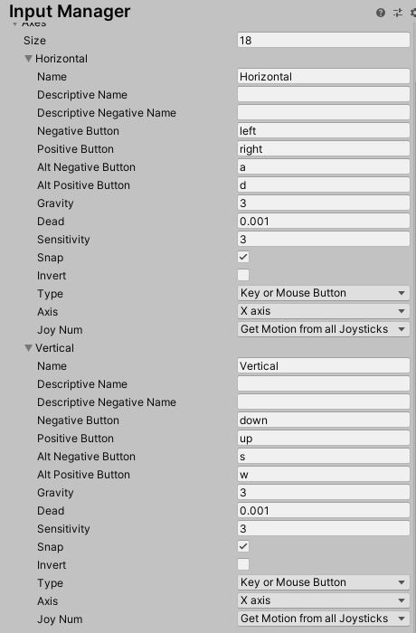

# Game-Dev-TC-modul-1
Modul 1 Komunitas Game Dev TC 2020

## Tujuan
1. Peserta memahami unity
2. Peserta memahami GameObject dan Components
3. Peserta memahami Script Mono Behaviour
4. Peserta memahami Input System
5. Peserta dapat mengubah properti component

## Unity
Unity adalah Game Engine Cross-Platform yang dikembangkan oleh Unity Technologies. Berikut adalah layout editor yang paling umum.

- (A) Toolbar memberikan kontrol ke scene view dan game object. Bagian kiri ada hand tool, move tool, rotate tool, scale tool, rect tool, multi tool. Bagian ditengah ada kontrol play, pause, dan step control. Bagian dikanan ada kontrol untuk unity collab, account, layers dan layout.
- (B) Hierarchy berisi representasi struktur game object di scene. Jadi semua game objek di scene dapat dilihat di hierarchy.
- (C) Game View menunjukkan apa yang dilihat oleh kamera atau yang akan dilihat oleh pemain.
- (D) Scene View adalah cara kita untuk melihat atau mengedit game objek yang ada di scene. Scene View dapat melihat scene dari prespektif 2D atau 3D.
- (E) Inspector View menunjukkan list komponen - komponen beserta propertinya untuk objek yang sedang diselect.
- (F) Project Window menunjukkan file atau asset yang dapat digunakan dalam gamenya.
(https://docs.unity3d.com/Manual/UsingTheEditor.html)

## Game Object dan Component

### Game Object
Game Object adalah representasi objek didalam unity. Game Object dapat merepresentasikan karakter, prop, pohon, dan lain-lain. Game Object berfungsi sebagai container component. Component ini yang mempunyai fungsi atau tujuan masing-masing.

#### Membuat Game Object


Untuk membuat game object, klik kanan di hierarchy, lalu klik Create Empty.

#### Mengganti nama Game Object
Untuk mengganti nama Game Object, dapat klik kanan suatu game object lalu rename. Selain itu dapat menggunakan shortcut F2.
(https://docs.unity3d.com/Manual/class-GameObject.html)

### Transform Component
Setiap Game Object minimal mempunyai satu komponen, yaitu Transform. Transform mengontrol posisi, besar, dan rotasi game objek. Selain itu transform juga memungkinkan konsep parenting.
(https://docs.unity3d.com/Manual/Components.html)

### Other Component
Selain itu Game Object juga dapat mempunyai komponen-komponen lain.
#### Adding Component


Untuk menambahkan komponen lain. Klik game object yang ingin ditambahkan. Lalu klik Add Component dan pilih component yang mau ditambahkan.
#### Removing Component


Untuk menghapus komponen. Klik simbol tiga titik di pojok kanan component. Lalu klik Remove Component.
#### Editing Component


Mengubah properti component dengan merubah isi checkbox, dan text box yang ada di component masing masing.
(https://docs.unity3d.com/Manual/UsingComponents.html)

## Mono Behaviour Script

### Membuat Script
Klik kanan di project view > Create > C# Script

### Anatomy Script
Berikut adalah script default yang akan dibuat oleh unity.
```
using UnityEngine;
using System.Collections;

public class Movement : MonoBehaviour {

    // Use this for initialization
    void Start () {
    
    }
    
    // Update is called once per frame
    void Update () {
    
    }
}
```
Dapat dilihat ada 2 function yang dibuat oleh unity
- ```Start``` dipanggil sekali saat game object pertama masuk di scene
- ```Update``` dipanggil setiap frame

### Menempelkan script ke game object
Ada 2 cara,
1. Drag and drop script dari project view ke object yang diinginkan di hierarchy
2. Select object di hierarchy, klik add component, lalu cari nama script, tekan script tersebut

## Input System
Unity mempunyai built-in Input System yang dapat diakses di Project Settings. Menu project settings dapat di akses di Edit > Project Settings.
Input System dapat mendapat 3 jenis kontrol :
- Key adalah inputan keyboard
- Button adalah inputan dari tombol fisik, bisa dari mouse atau controller.
- Virtual Axis adalah mapped control. Jadi antar key atau button di map ke suatu string. Virtual axis dapat bernilai -1 sampai 1.

Virtual axis berisi :
| Property                        | Function |
| ------------------------------- | - |
| **Name**                        | Nama axis, untuk diakses di script |
| **Positive button**             | Tombol yang jika ditekan, akan memberi value 1 kepada axis. Tombol bisa keyboard, mouse, atau joystick |
| **Negative button**             | Tombol yang jika ditekan, akan memberi value -1 kepada axis. Tombol bisa keyboard, mouse, atau joystick |
| **Alternative positive button** | Tombol alternatif yang berfungsi sama seperti positive button |
| **Alternative negative button** | Tombol alternatif yang berfungsi sama seperti negative button |
| **Gravity**                     | Kecepatan axis kembali ke 0 saat tidak input (dalam Unit per Second) |
| **Dead**                        | Seberapa jauh user harus menekan tombol input sebelum meregister perubahan axis |
| **Sensitivity**                 | Kecepatan axis bergerak ke target value saat input (dalam Unit per Second) |
| **Snap**                        | Jika diaktifkan, axis akan bernilai 0 saat tombol berlawanan ditekan. |
| **Type**                        | Tipe input : Key atau mouse button, Mouse movement, Joystick axis |
| **Axis**                        | Axis alat yang mengontrol ini (Untuk joystick) |
| **JoyNum**                      | Joystick yang terhubung untuk mengontrol axis |
Isi axis bisa berisi antara 2:
- Antara -1 dan 1. Untuk keyboard, tombol mouse, tombol joystick, dan joystick.
- Mouse delta, jarak mouse bergerak dari frame terakhir. (Bisa lebih besar dari 1 atau lebih kecil dari -1).

Untuk mendapatkan input dari Input Manager. Kita dapat menggunakan static class Input. Kita dapat menggunakan fungsi ```GetKey```, ```GetButton```, dan ```GetAxis```.
(https://docs.unity3d.com/Manual/class-InputManager.html)

## Mengubah Properti Component
GameObject dalam unity dikontrol oleh komponen-komponennya. Untuk mendapatkan komponen-komponen unity ini dalam script. Kita bisa menggunakan fungsi ```GetComponent<T>```. Fungsi ```GetComponent<T>``` akan mengembalikan Object dengan tipe T. Dengan object ini, kita bisa mengakses properti-properti didalam komponen tersebut. 
**(Beberapa komponen seperti transform, dapat diakses secara langsung oleh mono behaviour tanpa menggunakan ```GetComponent<T>```)**

## Membuat simple player control dengan transform
Untuk modul kali ini, kita akan mencoba untuk membuat simple player control.
Pertama, buat sprite kotak dengan klik kanan di project window. Lalu create > Sprites > Square.



Setelah itu, harusnya akan terbuat file square didalam project window. Setelah membuat sprite, kita akan buat empty game object. Dengan klik kanan di project hierarchy lalu klik Create Empty.


Dalam game object yang sudah kita buat. Kita akan mereset transformnya, agar berada di posisi (0, 0, 0).



Lalu, kita akan tambahkan component Sprite Renderer. Dengan mengklik add component > ketik Sprite Renderer.



Pada properti Sprite, akan berisi kosong. Kita akan drag and drop sprite square yang kita buat tadi, ke dalam kolom sprite tersebut.



Kalau sudah di drag-drop seharusnya akan ada kotak dalam scene view, dan Komponen sprite renderer akan terlihat seperti berikut.



Selanjutnya, kita akan membuat script. Untuk membuat script, klik kanan di project window > create > C# script. Untuk penamaannya, kita akan namai "Movement".



Double klik script tersebut. Maka kode akan terbuka dalam code editor.
Scriptnya akan terlihat seperti berikut.

```
using System.Collections;
using System.Collections.Generic;
using UnityEngine;

public class Movement : MonoBehaviour{

    void Start(){

    }

    void Update(){

    }

}
```

Tulislah kode berikut ke dalam script.

```
using System.Collections;
using System.Collections.Generic;
using UnityEngine;

public class Movement : MonoBehaviour{

    private Transform tr;
    private float speed = 5;

    void Start(){
        tr = GetComponent<Transform>();
    }

    void Update(){
        float x = Input.GetAxis("Horizontal");
        float y = Input.GetAxis("Vertical");

        tr.Translate(new Vector3(x * Time.deltaTime * speed, y * Time.deltaTime * speed));
    }

}
```

Masukkan script tersebut ke dalam game object tadi.



Jalankan game dengan klik tombol play di atas tengah.





Selamat, kamu sudah membuat kontrol player sederhana.
Dari script diatas, ada beberapa hal yang terjadi.
Pertama, kita membuat variabel ```tr``` dan ```speed```. ```speed``` adalah kecepatan player berjalan. Variabel ```tr``` untuk menyimpan component Transform yang akan kita ubah posisinya.

Pada fungsi Start, kita mendapatkan instance komponen transform dengan fungsi ```GetComponent<T>```. Ingat fungsi start hanya akan dieksekusi sekali, saat game object pertama kali masuk scene.

Pada fungsi Update, kita membuat 2 variable local ```x``` dan ```y```. ```x``` dan ```y``` adalah arah player bergerak. Kita dapat menggunakan axis yang sudah dibuat unity, yaitu ```Horizontal``` dan ```Vertical```. Axis Horizontal sudah di map ke a, d,arrow-left, dan arrow-right secara default. Axis Vertical sudah di map ke w, s, arrow-up, dan arrow-down secara default. Untuk mengecek axis, bisa kita liat di Project Setting > Input Manager.



Lalu dengan arah input ini. Kita akan menggerakkan game object dengan fungsi ```Translate``` yang ada di object ```tr```. Translate artinya menggerakkan game objectnya dengan parameter ```delta``` yaitu sebuah vector 3. Jadi kita buat vector 3 dengan x hasil dari ```x``` dikali ```speed``` dan ```Time.deltaTime```, dan y hasil dari ```y``` dikali ```speed``` dan ```Time.deltaTime```. Alasan kita harus mengkali dengan deltaTime adalah fungsi ```Update``` dijalankan setiap frame. Framerate suatu game bisa dianggap tidak konsisten kecuali dibuat maximum. Ini mencegah orang yang mempunyai frame rate lebih besar untuk bergerak lebih besar daripada orang yang mempunyai frame rate kecil. Dengan ini, kecepatan player akan sama di semua device.